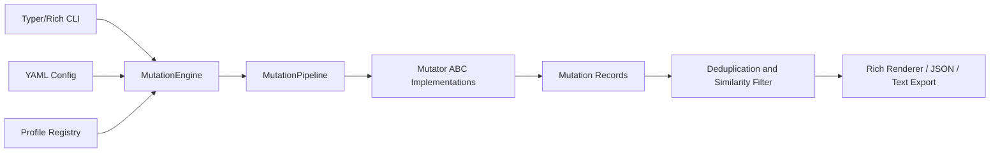

# MutaX Architecture

MutaX is organized as a profile-aware mutation pipeline. Mutators are deliberately small:
each one owns one transformation family, emits candidate strings, and lets the engine attach
metadata, scores, entropy, and transformation history.

Future HTTP testing modules can consume `MutationBatch` directly without parsing terminal output.

